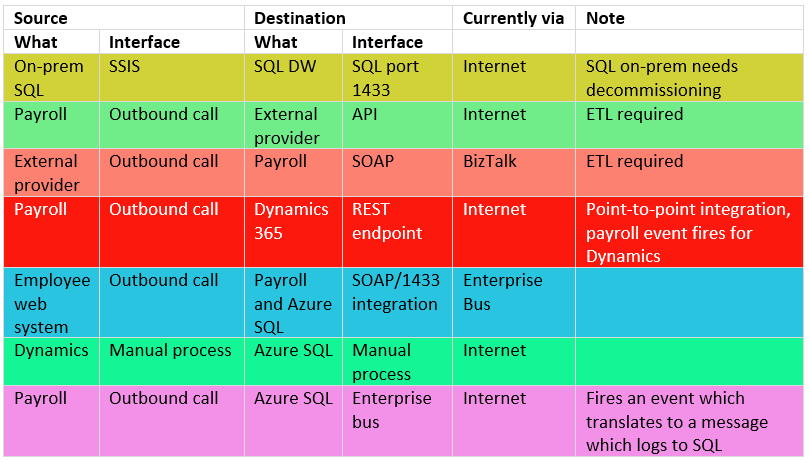

### Overview
Fluffy Ducks co. is a large, multinational firm with offices in Melbourne (head-office, datacentre), Helsinki, and Ushuaia. The corporation has used biztalk of varying versions for the last 10 years to integrate on-prem -> on-prem and on-prem -> Azure. For data integration between disparate systems, they’ve relied on manual SSIS package execution on local DBA laptops. Fluffy Ducks co. have encountered multiple issues with both application and data integration and have convinced the business to invest in a modernization of their integration platform with a cloud-first approach where possible. 

### Current status
* BizTalk is end-of-life
* Local server hardware is reaching end-of-life and has had reliability issues, need to move SQL to the cloud
* Local developer laptops have become unstable when running SSIS packages, with no traceability or ability to roll-back changes, resulting in multi-day outages.
* The number of point-to-point integrations has grown substantially over time, increasing the administrative overhead exponentially. All of which differ in spec and API contract.
* When a point of integration is updated, this is an atomic change with no ability to rollback
* When an event happens in Dynamics, there is no automated way to check this
* Messaging to/from payroll into the cloud have a variable size limit; from kilobytes to multiple megabytes for things like PDF exchange
* Some payroll functionality migrating to d365, most functionality needs to be migrated into Azure, with a seperate backend and front-end. Keep in mind, some legacy endpoints and data will remain on-prem
* Business has appetite for innovation and redesign of current architecture

#### Business requirements
* When a new-hire is created in payroll, that same employee information is automatically created/synced to down-stream systems
* Reduce the amount of downtime currently experienced with changes, subsequently increasing the agility of the business
* Decrease the amount of administrative overhead
* Provide a better experience when working with partner organizations (onboarding, data and API exchange, documentation)
 
### Integration Systems
**Note: Row colour correlates to flow in diagram**

#### Technical requirements
* Must replace BizTalk with a solution
* Must ensure DBAs don’t have to run SSIS packages locally
* Payroll system has ability to call out (HTTP, webhook, etc.), provides a SOAP interface to call in
* Payroll system VM needs to migrate to Azure, with seperate back-end API and front-end
* Employee web system currently in Azure needs to be modernized to a seperate back-end API and front-end
* On-prem SQL needs to be replaced with cloud solution (such as Cosmos)

#### Assumptions
* Moving forwards, ExpressRoute exists from on-prem into Azure
* Organization is not limited to what they can deploy into Azure
* Azure SQL can be re-architected to Cosmos to reduce complexity and moving parts
* Remember, business has appetite to redesign architecture and write/consume new services
* External provider remains the same
